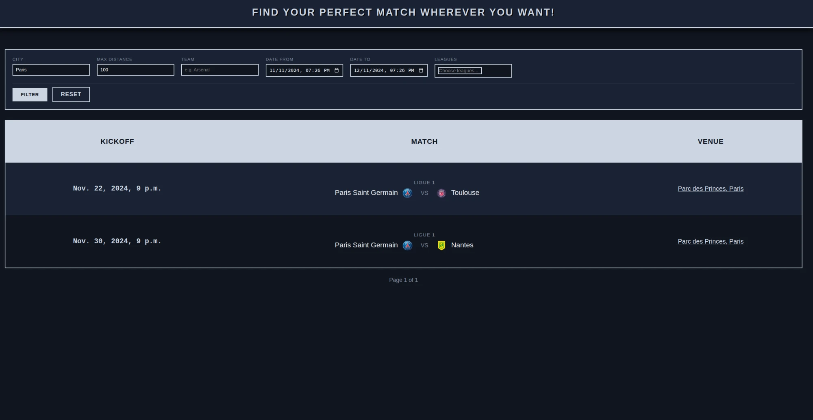

# GameFinder

A Django app for finding football matches by city, distance, team, league and date.



## About

GameFinder pulls football fixtures (matches, teams, leagues, venues) from the [API-Sports](https://www.api-football.com/) football API and stores them in a local database.

Each stadium's address is turned into map coordinates (latitude/longitude) using the [Nominatim](https://nominatim.org/) geocoding service, which is free and based on OpenStreetMap data.

When you search for matches near a city within a certain distance, the app:
1. Looks up the coordinates of the city you typed.
2. Does a quick, rough filter to throw out stadiums that are obviously too far away.
3. Calculates the exact distance to each remaining stadium using the [Haversine formula](https://en.wikipedia.org/wiki/Haversine_formula), which measures distance between two points on a sphere.
4. Shows only the matches played at a stadium within your chosen radius.

You can also filter by date range, so this is a great way to plan ahead — e.g. you're going somewhere for a week and want to see if there's a match nearby during your trip.

## Quick start

```bash
python3 -m venv .venv
source .venv/bin/activate
pip install -r requirements.txt
python3 manage.py migrate
python3 manage.py runserver
```

Then open `http://localhost:8000`.

## About the included database

`db.sqlite3` is checked into this repo **as sample data**, so the app works out of the box without needing your own API key — it's a snapshot of real fixtures fetched at some point in time, not live, constantly updated data.

## Refreshing the data yourself

If you want current fixtures instead of the bundled snapshot, you'll need your own [API-Sports](https://www.api-football.com/) key:

1. Create a `.env` file in the project root with:
   ```
   API_SPORTS_KEY=your_key_here
   ```
2. Run:
   ```bash
   python3 manage.py fetch_data
   python3 manage.py geocode
   ```

`fetch_data` pulls fixtures, teams, leagues and venues from the API. `geocode` looks up coordinates and timezones for venues that don't have them yet (used for the distance-based city search).

By default `fetch_data` pulls the 2024 season. To fetch a different season instead:
```bash
python3 manage.py fetch_data --season 2025
```
